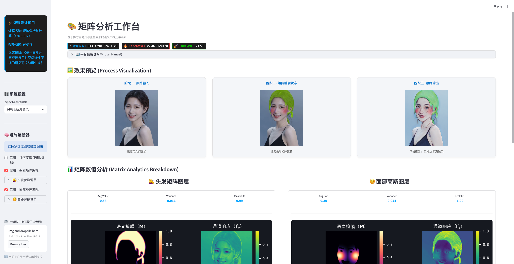

# 矩阵分析与语义可控动漫生成（MatrixCourseDesign）



本项目为课程设计成果：基于矩阵变换与语义分割的可控风格迁移系统，集成矩阵级别的颜色编辑、几何变换与 AnimeGAN 风格迁移。该系统以交互式 Streamlit 界面为前端，使用 BiSeNet 做面部分割，并提供可复现的模型结构与推理代码。(注意：本项目仅为课程教学设计示例，未产生任何经济收益)

## 项目亮点
- 矩阵几何变换：支持仿射变换、透视变换与水平翻转，用户可调节参数实时预览效果。
- 风格迁移：集成轻量级风格生成器，支持多套预训练权重（`animegan/weights/`）。
- 语义可控：基于人脸语义分割（头发、面部等）进行局部矩阵编辑，支持头发漂白与面部腮红等效果。
- 矩阵编辑：从颜色空间转换、局部高斯权重到软融合的完整矩阵运算实现（`matrix.py`）。


## 快速开始（3 步）

下面给出从仓库拉取、使用 `conda` 创建虚拟环境并安装依赖的推荐步骤（可复制粘贴执行）。

1. 从 GitHub 拉取代码并进入项目目录：

```bash
git clone git@github.com:dunzane/MATRIXCOURSEDESIGN.git
cd MATRIXCOURSEDESIGN
```

2. 使用 `conda` 创建并激活虚拟环境（示例使用 Python 3.10）：

```bash
conda create -n matrixcourse python=3.10 -y
conda activate matrixcourse
```

3. 安装依赖：

```bash
pip install -r requirements.txt
```

完成后可以运行演示：

```bash
streamlit run app.py
```

4. 启动演示界面：

```bash
streamlit run app.py
```

打开浏览器，访问本地 Streamlit 页（通常为 `http://localhost:8501`），在侧栏上传图片或使用示例图片，选择风格并调整矩阵/几何参数。

## 使用说明（要点）

- 侧栏选择动漫风格：模型文件通过 `STYLE_MAP` 映射到 `animegan/weights/*.pt`。确保所选权重存在。
- 启用“矩阵编辑”模块以对头发/面部做局部色彩与亮度调整（实现见 `matrix.py`）。
- 启用“几何变换”可对展示流与 GAN 输入分别应用仿射/透视/翻转变换。
- 最终风格迁移在 `animegan/model.py` 中定义的 `Generator` 上执行。

## 项目结构（重要文件）

- `app.py`：Streamlit 前端与总体流程控制（加载模型、可视化、参数面板）。
- `matrix.py`：矩阵运算、颜色空间转换与局部编辑工具（HSV 转换、Gaussian mask、apply_matrix_color_edit 等）。
- `animegan/`：风格生成器实现与 `weights/` 目录（存放 .pt 权重）。
- `faceparsing/`：BiSeNet 面部分割模型与 `79999_iter.pth` 权重示例。
- `example/`：示例图片与演示资源（应用加载的默认示例路径为 `example/test.png`）。


## 开发与复现说明

- 代码兼容 PyTorch 1.13+（视 CUDA 驱动与显卡而定）。若需 GPU 加速，请安装带 CUDA 的 `torch` 版本（参考官方安装指引）。
- 若要在无 GPU 的环境中运行，可在 CPU 上运行，但推理速度会显著下降。
- 若需训练新的风格模型或分割模型，建议准备相应的数据集并复用 `animegan/model.py` 与 `faceparsing/` 中的网络结构。

## 示例命令

启动 Streamlit：

```bash
streamlit run app.py
```

在 Python 中直接调用某些模块（例如离线推理 / 单元测试）：

```python
from matrix import apply_matrix_color_edit, get_segmentation_mask
from animegan.model import Generator
from faceparsing.model import BiSeNet
```

## 注意事项

- 请确保以下文件路径与权重存在：
  - `animegan/weights/*.pt`
  - `faceparsing/79999_iter.pth`
- 程序默认字体路径为 `~/data/fonts/SimHei/SimHei.ttf`，如不存在会回退到系统默认字体。

## 贡献与联系方式

若要贡献代码或模型，请提交 Pull Request 或在 Issues 中创建讨论。项目作者：（邮箱 / 联系方式请在课题组内部渠道获取）。

